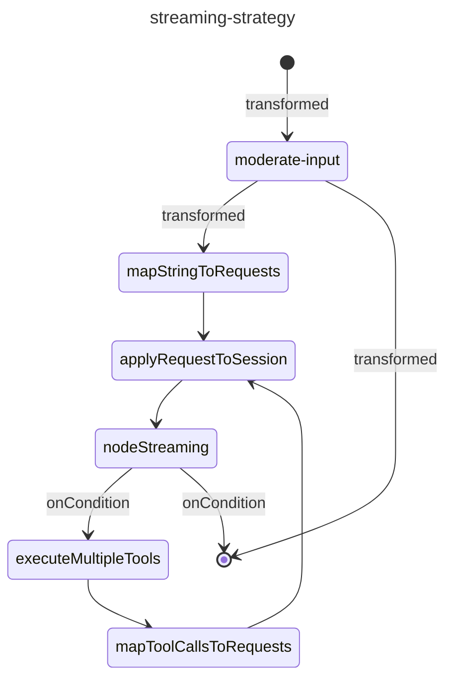

Koog is an AI framework, so the appropriate AI-Mocks module depends on the provider configured in
your application. Use the corresponding [AI-Mocks provider guide](../../ai-mocks/) when Koog is
configured for a supported provider.

The verified end-to-end example on this page is the OpenAI-backed pattern from the
[`koog-spring-boot-assistant`](https://github.com/kpavlov/koog-spring-boot-assistant/tree/main/integration-tests/src/test/kotlin/com/example/it)
integration tests. In that setup, Koog talks to an OpenAI-compatible provider, so the integration
point is [AI-Mocks OpenAI](../../ai-mocks/openai/) rather than plain Mokksy. The tests start
`MockOpenai`, point Koog at `mockOpenai.baseUrl()`, and exercise the real Spring Boot application
through HTTP and WebSocket clients.

## Workflow context from the sample repo

The sample application is not a single prompt-in, prompt-out flow. Its README describes a Koog
strategy with moderation, request mapping, streaming LLM output, and tool execution. That context
matters because the integration tests stub several provider endpoints, not just one chat response.



The same repository also exposes this graph through `/api/koog/strategy/graph`, and the
integration tests assert that the endpoint returns Mermaid output for the running strategy.

## Inject the mock server into Koog

The sample app starts `MockOpenai` once in the test environment, prepares deterministic embeddings
for RAG ingestion, and then injects the mock base URL into Koog before Spring Boot starts:

```kotlin
object TestEnvironment {
    val mockOpenai = MockOpenai(verbose = true)

    init {
        System.setProperty("OPENAI_API_KEY", "dummyOpenAIKey")
        System.setProperty("spring.profiles.active", "test")

        listOf(
            "Care for Magical Trees",
            "Valley of Light",
            "Magical Bow",
            "Morning Pine Elixir",
            "Teleportation and Portals",
        ).forEach {
            mockOpenai.embeddings {
                inputContains(it)
            } responds {
                delay = 1.milliseconds
            }
        }
    }
}

object Server {
    init {
        System.setProperty("ai.koog.openai.base-url", TestEnvironment.mockOpenai.baseUrl())

        SpringApplication.run(
            com.example.app.Application::class.java,
            "--server.port=0",
            "--spring.profiles.active=test",
        )
    }
}
```

This keeps the real Koog and Spring Boot wiring intact while replacing the provider dependency with
a deterministic local server.

The sample application also performs embedding requests during startup for RAG ingestion. Those
embedding stubs must exist before Spring Boot starts, or the application will make unmatched calls
while the test environment is still booting.

## Test the full Koog request path

The positive-path test in the sample repo drives the real application client, not Koog internals.
It stubs embeddings, moderation, and the chat completion stream, then verifies the final answer:

```kotlin
mockOpenai.embeddings {
    stringInput(question)
} responds {
    delay = 40.milliseconds
}

mockOpenai.moderation {
    inputContains(question)
} responds {
    flagged = false
}

mockOpenai.completion {
    systemMessageContains("witty and wise Elven assistant guiding adventurers")
    userMessageContains(question)
} respondsStream {
    responseFlow = flowOf(expectedAnswer)
}

val response = chatClient.sendMessage(question)
```

That test shape is useful when you want to prove prompt routing, moderation checks, RAG lookups,
and provider calls still produce the expected application response.

## Stream token-by-token output

The same repo includes a WebSocket integration test that verifies streaming delivery timing. The
mock server emits one token chunk at a time with a fixed delay between chunks:

```kotlin
val delayBetweenChunks = 500.milliseconds

mockOpenai.completion {
    systemMessageContains("witty and wise Elven assistant guiding adventurers")
    userMessageContains(question)
} respondsStream {
    responseFlow =
        expectedTokens
            .asFlow()
            .onEach { delay(delayBetweenChunks) }
}
```

The test then measures the WebSocket output and checks that Koog forwards the token stream with the
expected pacing. This is the right place to catch buffering mistakes and streaming regressions.

## Exercise moderation and failure paths

The sample repo does not stop at happy-path chat. It also verifies:

- moderation blocking with `mockOpenai.moderation { ... } responds { flagged = true }`
- embedding failures with `respondsError { httpStatusCode = ... }`
- moderation API failures with fallback behavior
- LLM request failures for both SSE and non-streaming completion paths

For example, the failure test uses provider-like HTTP status codes such as `400`, `401`, `403`,
`404`, `418`, `500`, and `503`, then verifies that the application returns a stable fallback
message instead of crashing.

## Verify Koog-specific endpoints too

The repo also tests a Koog strategy-graph endpoint by fetching
`/api/koog/strategy/graph` and asserting that the response contains Mermaid state-diagram output.
That is a useful pattern when your application exposes Koog diagnostics or graph introspection
routes in addition to chat endpoints.

## Source and next steps

- [Koog Spring Boot Assistant integration tests](https://github.com/kpavlov/koog-spring-boot-assistant/tree/main/integration-tests/src/test/kotlin/com/example/it)
- [AI-Mocks providers](../../ai-mocks/)
- [AI-Mocks OpenAI](../../ai-mocks/openai/)
- [Spring Boot](../spring-boot/)
- [OpenAI SDK](../openai-sdk/)
